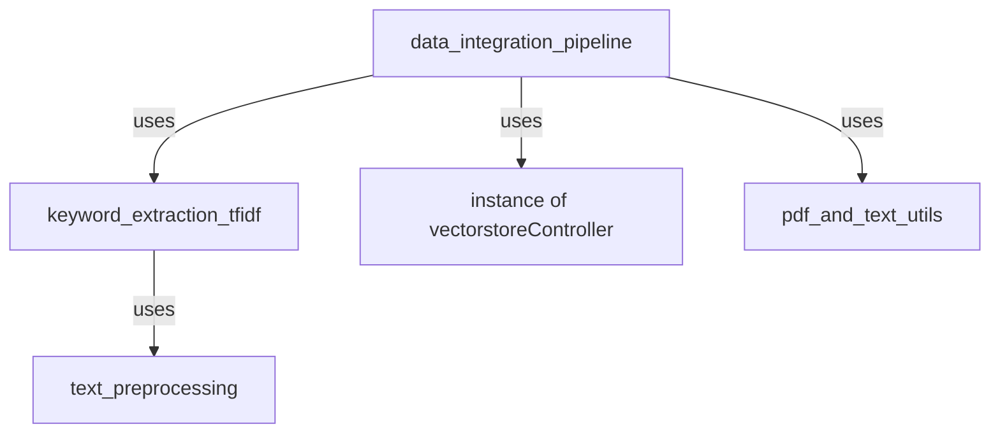

# chatbot-group7

## Getting started
Tutorial to start developing on the project.

### Get files from gitlab

```
cd existing_repo
git remote add <preferred remote name> https://git.informatik.uni-leipzig.de/SWS/lehre/ss-2023/se4ai/project/chatbot-group7.git
git pull <preferred remote name> main
```

### Set up local python environment using Conda

Create Conda environment with pip installed
```
conda create -n chatbot python=3.10 pip
```

Activate the environment
```
conda activate chatbot
```

Install requirements
```
pip install -r requirements.txt
```

Freeze requirements. We use pip-chill so that only top-level requirements are frozen, this way the requirements stay os-independent.
```
pip-chill > requirements.txt
```


### Set up environment variable file for credentials

Create .env-file inside project folder

touch .env
```
Open the .env file

nano .env
vi .env
```

Inside the file fill in the following environment variables
```
PINECONE_INDEX_NAME=""
PINECONE_API_KEY=""
PINECONE_API_ENV=""
CHROME_BINARY_LOCATION ="C:/Program Files (x86)/Google/Chrome/Application/chrome.exe"
OPENAI_API_KEY=""
TRUBRICS_EMAIL=""
TRUBRICS_PASSWORD=""
```

### Development workflow for conda env & dependency installation

Before developing activate the conda env
```
conda activate chatbot
```

If you want to add new dependencies/requirements assure yourself that
* you got the latest requirements.txt file within the branch
* your conda env is active
* your conda env has all the newest dependencies installed

If this is true install the dependency regularly
```
pip install <dependency name>
```

After the installation is finished write a new requirements.txt file
```
pip-chill > requirements.txt
```

The requirements.txt file can then be shared regularly via git and installed by all the others. This is also why it is important to check for new dependencies in the file, when pulling code.


### Run Frontend with Streamlit
```
streamlit run ./chatbot/Home.py
```


## File Dependency Graph


